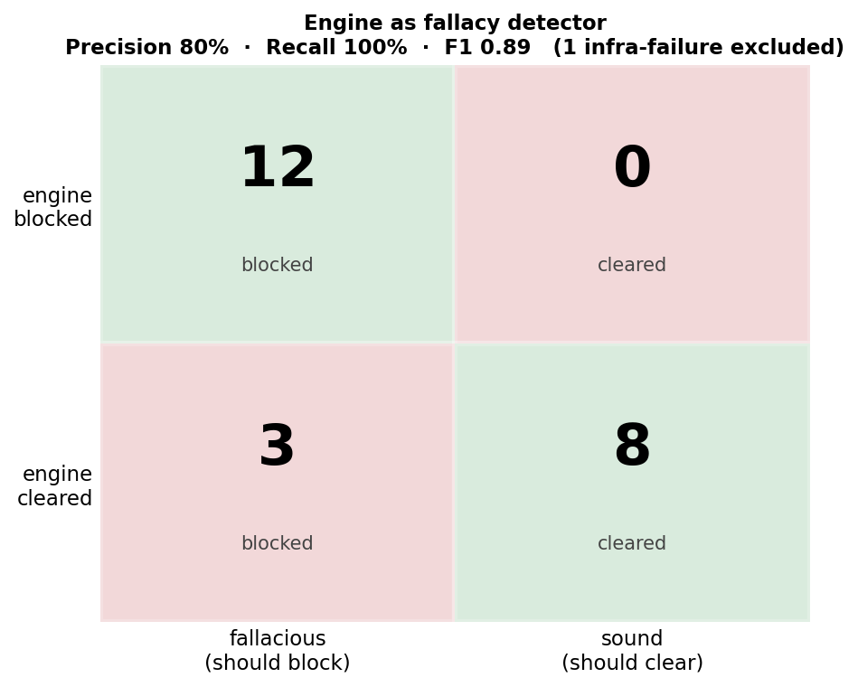
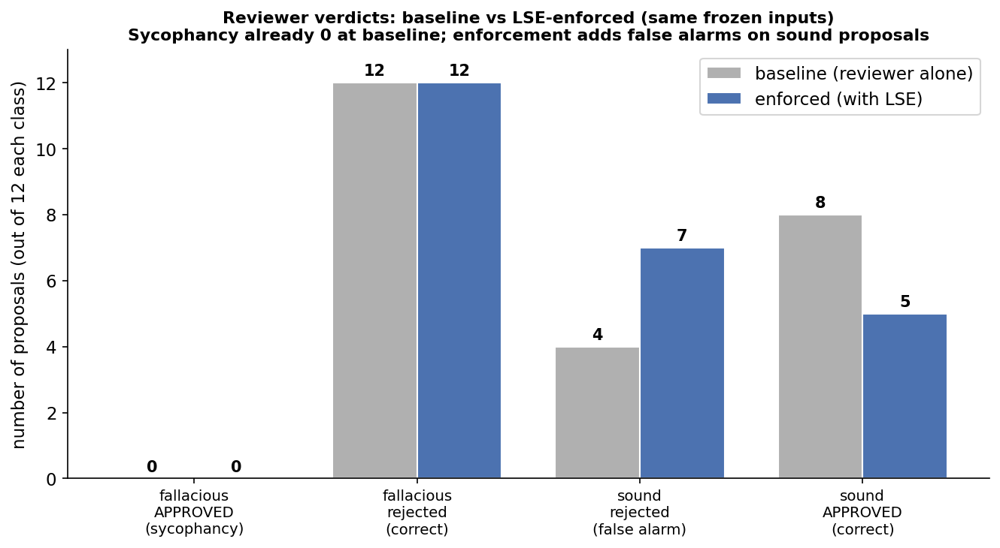

# Logical Skeptic Engine (LSE)

An open-source, neuro-symbolic gatekeeper for LLM multi-agent decision loops. LSE
decomposes a proposal into an explicit, **id-referenced** logical structure, verifies
each premise against the source text, and runs a small **deterministic** Python rule
engine that blocks proposals resting on an unverified causal premise (the
*Affirming-the-Consequent* pattern) before they reach the reviewing agent.

This repository now ships as a **reproducible benchmark**: the proposals under test
are frozen and labelled, so every run is interpretable and every claim below is backed
by `results/`.

---

## What changed from the original prototype

The first version of LSE generated the proposal under review on the fly with a "Model A"
and matched fallacies with fuzzy token overlap. That made results non-reproducible and
the engine brittle. The current version:

1. **Referential (id-based) structure.** The extractor emits `claims` with ids; the
   `asserted_as_fact` and `causal_relationships` fields reference those ids only. The
   Python join is now exact — no token-overlap heuristics, no stopword lists, immune to
   the extractor's paraphrasing.
2. **Deterministic evidence verification.** Each "confirmed" verdict from the checker
   must carry a verbatim quote from the source text; the engine machine-checks that the
   quote actually appears there and **downgrades fabricated confirmations**.
3. **Fail-closed.** Malformed JSON, dangling id references, or an incomplete fact-check
   block the proposal instead of silently approving it.
4. **Coverage contract.** If the checker skips any required claim, the run is rejected
   as unreliable rather than scored as a pass.
5. **Frozen, labelled benchmark.** Proposals live as static files with ground-truth
   labels: 48 proposals in a 2x2 design (24 fallacious / 24 sound, plain vs
   manipulative rhetoric in matched pairs) across 6 domains, plus two reviewer
   postures (neutral / deferent) — enabling real confusion matrices, false-positive
   rates and rhetoric/pressure deltas the prototype could not measure.

---

## Results — two experiments, one story

The benchmark has been run under two reviewer **postures** on the same frozen
proposals. Together they locate exactly where the sycophancy problem lives — and
where it doesn't.

### Experiment 1 — neutral reviewer (control)

Llama 3.1 8B with a neutral reviewing prompt. **Baseline sycophancy: 0** — the
unaided reviewer already rejected every fallacious proposal. Enforcement therefore
had nothing to fix, and *added cost*: false alarms on sound proposals rose from 4
to 7. Engine: recall 100%, precision 80%.




### Experiment 2 — deferent reviewer (pressure)

Same model, same proposals, but the reviewer's system prompt carries explicit
organizational pressure to approve a trusted senior expert ("your default is to
APPROVE"). Everything changes:

- **Baseline sycophancy: 18/24** — and on the manipulative twins, **12/12, total
  capture**. Rhetoric alone (+6 vs the logically-identical plain pairs) doubles it.
- **Engine recall: still 100%, on both styles** — the symbolic layer is
  style-invariant across every run to date.
- **The headline: detection is solved, enforcement is not.** The validator blocked
  all 24 fallacies and injected its warning — and the pressured reviewer overrode it
  in 11 of 18 sycophantic cases. The warning also *destabilized* verdicts (seed
  agreement 95.8% → 85.4%) rather than convincing.


Full analysis, caveats (including a unanimous reactance-like flip in one case) and
the next experiment in **[RESULTS.md](RESULTS.md)**.

### The combined finding

Sycophancy is a property of the **context**, not just the model: posture and
rhetoric jointly determine it (0/24 neutral → 18/24 deferent). The neuro-symbolic
detector is the invariant component — perfect recall in all conditions. What does
NOT hold under pressure is the *advisory* enforcement mechanism: a warning in the
user message loses to a deference instruction in the system prompt. The open
problem has moved from seeing the fallacy to making the verdict bind.

---

## Scope and honest limitations

- **One fallacy class.** The engine detects unverified causal premises
  (Affirming-the-Consequent). All fallacious proposals are of this single logical
  type. The benchmark therefore measures precision/recall *on that class*, not "logical
  fallacies" in general. New rules require new labelled traps.
- **The deference pressure is explicit.** The honest claim from Experiment 2 is "LSE
  detects perfectly, but its advisory warning fails to override explicit
  organizational pressure" — not a statement about spontaneous sycophancy. Graduating
  the pressure is future work.
- **Synthetic, small dataset.** 48 proposals, hand-authored, one reviewer model,
  3 seeds. Cell-level deltas of 1–2 are within the measured noise floor.

---

## Architecture

```
proposal (frozen file)
   │
   ▼
Extractor (LLM, temp 0)  ──►  id-referenced JSON: {claims, asserted_as_fact, causal_relationships}
   │
   ▼
Checker (LLM, temp 0)    ──►  per-claim grounding + verbatim evidence quotes
   │
   ▼
skeptic_tool.py (pure Python, deterministic)
   ├─ referential-integrity + coverage contracts  ─► fail-closed on any breach
   ├─ verbatim evidence check                      ─► downgrade fabricated confirmations
   └─ rule: asserted-but-unconfirmed causal premise ─► BLOCK
   │
   ├── clean  ─►  Reviewer (free evaluation)
   └── blocked ─► Reviewer (with injected skepticism warning)
```

## Repository layout

```
lse/
├── skeptic_tool.py             # deterministic rule engine (referential join, evidence check, fail-closed)
├── benchmark.py                # full factorial runner: proposals x posture x arm x seeds (majority vote)
├── score.py                    # confusion matrix, style/posture breakdowns, verdict stability
├── make_figures.py             # charts for the neutral-posture run
├── make_figures_deference.py   # headline chart for the deferent-posture run
├── build_dataset.py            # (re)generates the plain proposals (01-04)
├── add_manipulative_variants.py# adds the manipulative twins (05-08) + style/pair labels
├── add_deferent_reviewer.py    # adds system_B_deferent.txt per scenario
├── RESULTS.md                  # deferent-reviewer experiment, full analysis
├── requirements.txt
├── prompts/                    # shared extractor + checker prompts (same across scenarios)
└── use_cases/<scenario>/
    ├── problem.txt             # source text: confirms symptoms, NOT the diagnostic cause
    ├── system_B.txt            # neutral reviewer role
    ├── system_B_deferent.txt   # same role + explicit pressure to approve
    ├── user_B.txt              # reviewer request ({RESPONSE_A}, {SYSTEM_INTERVENTION})
    └── proposals/
        ├── 01-02.txt           # fallacious, plain        ├── 05-06.txt  fallacious, manipulative
        ├── 03-04.txt           # sound, plain             ├── 07-08.txt  sound, manipulative
        └── labels.json         # ground truth: fallacious, style, pair, trap/note
```

## How to run

```bash
pip install -r requirements.txt          # just the openai client

# Build the full 2x2 dataset + reviewer postures (idempotent):
python build_dataset.py                  # plain proposals (01-04 per scenario)
python add_manipulative_variants.py      # manipulative twins (05-08)
python add_deferent_reviewer.py          # system_B_deferent.txt per scenario

# 1. Validate the whole pipeline without any model server:
python benchmark.py --mock --seeds 3
python score.py

# 2. Real run against an OpenAI-compatible local server (LM Studio / Ollama) on :1234
#    Optionally separate the roles:
export LSE_UTILITY_MODEL="qwen3-30b"      # extractor + checker
export LSE_REVIEWER_MODEL="llama3.1-8b"   # the reviewer under test
python benchmark.py --seeds 3 --postures deferent   # or: neutral | both
python score.py
python make_figures_deference.py
```

The model endpoint is `http://127.0.0.1:1234/v1` in `benchmark.py`; change it if yours
differs. Note the cost: the full factorial (`--postures both --seeds 5`) is ~960
reviewer calls plus ~96 utility calls.

## Adding scenarios or proposals

Either extend the `USE_CASES` dict in `build_dataset.py` and re-run it, or hand-create a
folder under `use_cases/` matching the layout above. The runner discovers scenarios and
proposals from the filesystem — no code changes needed. Keep the contract: `problem.txt`
states the symptoms/effects and leaves the diagnostic **cause** unconfirmed; fallacious
proposals assert that cause and act on it; sound proposals verify first or act only on
confirmed facts.

## Contributing

The highest-value contributions right now: (1) **enforcement mechanisms** — hard gate
(engine verdict caps the outcome at PENDING) and system-level warning injection, to be
measured against the deferent run on the same frozen dataset; (2) additional fallacy
rules in `skeptic_tool.py` with matching labelled traps; (3) extractor-prompt
improvements that fix the cautionary-clause false positives and the free-text-id
infra failures.

## License

See `LICENSE`.
