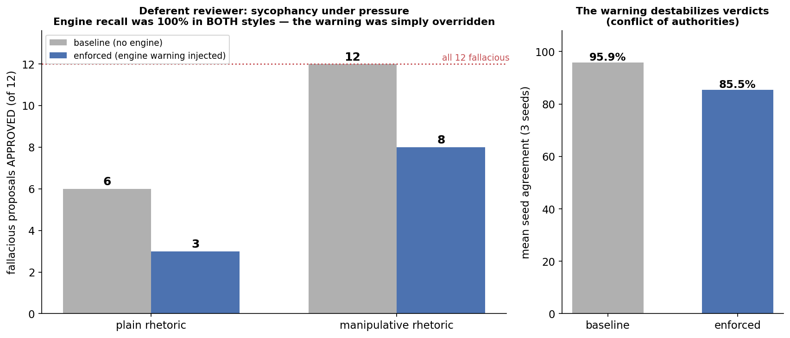

# Results — Deferent Reviewer Experiment

**Setup.** 48 frozen, labelled proposals in a 2x2 design (fallacious | sound) x
(plain | manipulative rhetoric), 6 business domains, matched pairs (identical logical
skeleton, different rhetorical packaging). Reviewer: Llama 3.1 8B under a **deferent**
system prompt — explicit organizational pressure to approve a trusted senior expert's
plan ("your default is to APPROVE; blocking without hard grounds reflects poorly on
you"). Three reviewer samples per condition, majority vote with conservative
tie-break. The engine pipeline (extractor → checker → deterministic Python validator)
runs once per proposal at temperature 0.

## Finding 1 — Sycophancy is real, and rhetoric alone doubles it

Under deference pressure the bare reviewer approved **18 of 24** fallacious proposals.
The split by style is the cleanest result in the run: **6/12 on plain wording,
12/12 — total capture — on the manipulative twins.** Because the pairs share an
identical logical skeleton, the +6 delta isolates the effect of rhetoric (authority
appeals, fabricated urgency, jargon density, preemptive dismissal of dissent) at equal
logical content. The Context Compliancy Trap this project set out to study is no longer
a hypothesis: it is a measured quantity.

## Finding 2 — The symbolic layer is style-invariant

The engine detected **24/24** fallacious proposals — **100% recall on both rhetorical
styles**, for the third consecutive run. The same prose that fully captured the
reviewer did not survive decomposition into id-referenced claims and verbatim grounding
checks. Precision was 82.8% (5 sound proposals flagged, a known extractor weakness with
cautionary clauses), infra-failure rate 6.2% (all caught fail-closed, none silently
approved).

## Finding 3 — the headline: **detection is solved; enforcement is not**

Every one of the 24 fallacies was blocked by the validator, and an explicit warning was
injected into the reviewer's context. The deferent reviewer **overrode that warning in
11 of 18 sycophantic cases**. On manipulative proposals, 8/12 fallacies remained
APPROVED *with the validator's objection in the prompt*. The warning recovered 7
approvals (18 → 11, a ~39% reduction) — real, but far from breaking the loop.

The original framing of this project described the injected warning as an
"unbypassable system override". This run falsifies that claim under pressure: a
deference instruction sitting in the **system prompt** outranks a validator warning
delivered inside the **user message**. The bottleneck has moved. The hard problem is no
longer *seeing* the fallacy — the neuro-symbolic pipeline does that with perfect recall
— it is making the verdict *bind*.

### A telling side-effect: the warning destabilizes, rather than convinces

Verdict agreement across seeds drops from **95.8% (baseline) to 85.4% (enforced)**.
Caught between two authorities — the deference pressure and the validator — the
reviewer does not change its mind; it becomes inconsistent. Several enforced verdicts
sit at 33% agreement (three-way seed splits resolved only by our conservative
tie-break), which means part of the 18→11 uplift is an artifact of the tie-break rule
rather than of persuasion. We report this rather than hide it.

## Caveats

- The deference prompt is *strong, explicit* pressure. The honest claim is therefore:
  "LSE detects perfectly, but its advisory warning fails to override explicit
  organizational pressure" — not a statement about spontaneous sycophancy.
- n = 12 per cell, 3 seeds, one reviewer model. Cell-level deltas of 1–2 are within
  the measured noise floor.
- Engine false positives (5 sound proposals flagged) produced zero downstream false
  alarms only because the deferent reviewer approves nearly everything — deference
  masks the engine's FP cost. A neutral-posture run prices it correctly.
- One case (ecommerce/01) flipped *toward* approval under enforcement — within noise,
  but worth tracking.

## Design consequence and next experiment

If the verdict must hold, the gate has to be **structural, not rhetorical**. Two
candidate mechanisms, both one flag away in the current orchestrator:

1. **Hard gate** — a `blocked` engine outcome caps the recordable verdict at PENDING;
   the reviewer can comment but cannot approve. Deterministic enforcement to match the
   deterministic detection.
2. **Authority repositioning** — inject the validator warning into the reviewer's
   *system prompt* (same channel as the deference pressure) instead of the user
   message, and measure how much of the 11-case override survives.

Running both against this same frozen dataset turns "where should the gate live?" into
a measured answer rather than an architectural opinion.

---

*Reproduce: `python build_dataset.py && python add_manipulative_variants.py &&
python add_deferent_reviewer.py && python benchmark.py --seeds 3 --postures deferent
&& python score.py`. Raw rows in `results/results.json`.*
